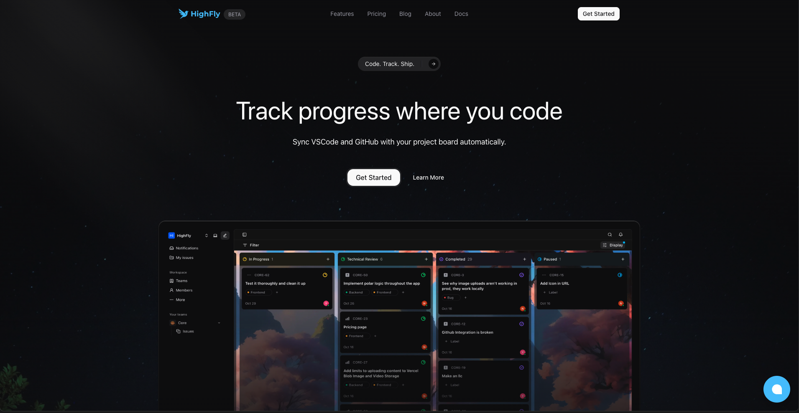
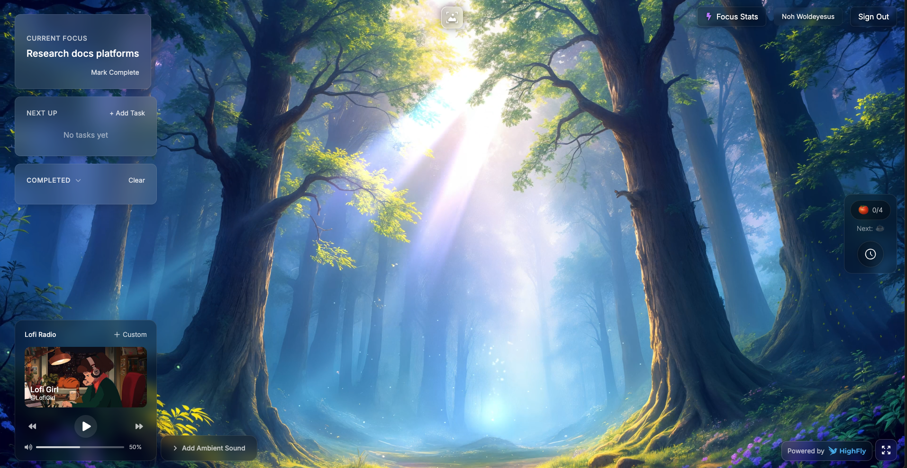
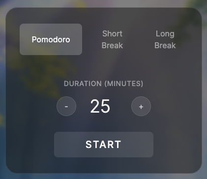
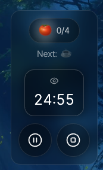
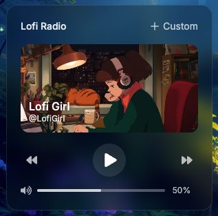
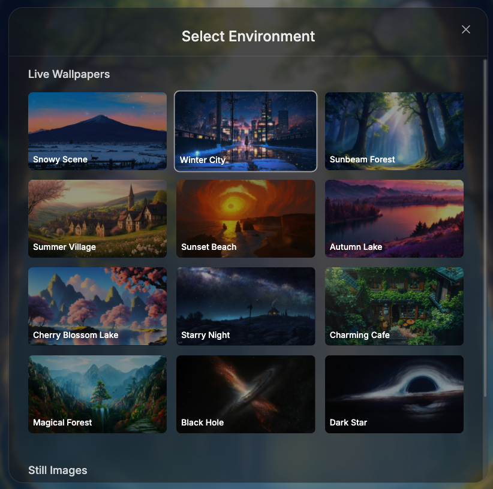
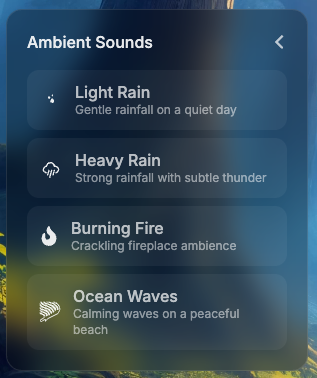
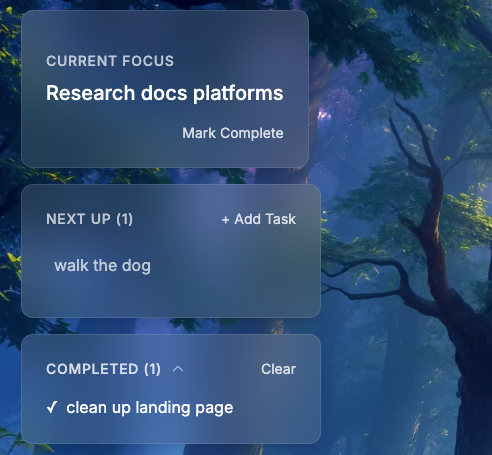
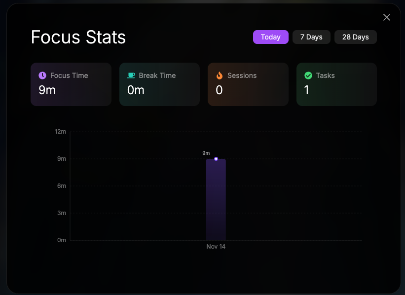

## [HighFly](https://highfly.app?ref=pomolofi)

Track issues directly in your code editor (VSCode, Cursor, Windsurf) and sync with GitHub automatically. Built for developers who want real project management without context switching. We've been using HighFly to manage PomoLofi and it's been a game changer. [Try it now!](https://highfly.app?ref=pomolofi)

[](https://highfly.app?ref=pomolofi)

---

# PomoLofi 🎵⏰

<div align="center">



**Your ultimate focus companion combining Pomodoro timers, lofi music, and beautiful ambient scenes**

[Live Demo](https://pomolofi.app)

[](https://nextjs.org/)
[](https://www.typescriptlang.org/)
[](https://tailwindcss.com/)

</div>

---

## ✨ Features

### 🎯 Pomodoro Timer
Customizable timer with automatic progress tracking and break reminders.

<div align="center">
  
  
</div>

### 🎵 Lofi Music Player
Built-in YouTube lofi streams (@LofiGirl, @ChillwithTaiki, @ChillhopMusic) plus custom video support.

<p align="center">
  
</p>

### 🌅 Beautiful Environments
Choose from 12 live wallpapers or 2 still images to set your perfect focus atmosphere.

<p align="center">
  
</p>

### 🔊 Ambient Sounds
Layer calming sounds over your music - rain, fire, or ocean waves.

<p align="center">
  
</p>

### ✅ Task Management
Keep track of your todos and daily progress.

<p align="center">
  
</p>

### 📊 Focus Statistics
Track your productivity with detailed charts and insights.

<p align="center">
  
</p>

---

## 🚀 Getting Started

### Installation

```bash
# Clone the repository
git clone https://github.com/yourusername/pomolofi.git
cd pomolofi

# Install dependencies
npm install

# Set up environment variables
cp .env.example .env.local
# Edit .env.local with your Firebase credentials

# Run development server
npm run dev
```

Open [http://localhost:3000](http://localhost:3000) in your browser.

### Environment Variables

Create a `.env.local` file with your Firebase credentials:

```env
NEXT_PUBLIC_FIREBASE_API_KEY=your_api_key
NEXT_PUBLIC_FIREBASE_AUTH_DOMAIN=your_auth_domain
NEXT_PUBLIC_FIREBASE_PROJECT_ID=your_project_id
NEXT_PUBLIC_FIREBASE_STORAGE_BUCKET=your_storage_bucket
NEXT_PUBLIC_FIREBASE_MESSAGING_SENDER_ID=your_sender_id
NEXT_PUBLIC_FIREBASE_APP_ID=your_app_id
```

---

## 🏗️ Tech Stack

- **Framework:** Next.js 14 with App Router
- **Language:** TypeScript
- **Styling:** Tailwind CSS
- **Animations:** Framer Motion
- **Auth & Database:** Firebase
- **Storage:** Vercel Blob Storage
- **Deployment:** Vercel

---

## 🤝 Contributing

Contributions are welcome! Open an issue or submit a PR.

---

## 📝 License

Apache 2.0 License - see [LICENSE](LICENSE) for details.

---

<div align="center">

## 🚀 Powered by HighFly

<a href="https://highfly.app?ref=pomolofi" target="_blank">
  
</a>

**All issue tracking and project management for PomoLofi is powered by [HighFly](https://highfly.app?ref=pomolofi)**

HighFly brings issue tracking directly into your code editor (VSCode, Cursor, Windsurf) so you can track progress without context switching.

**Try HighFly for your projects:** [highfly.app](https://highfly.app?ref=pomolofi)

---

Made with ❤️ by developers, for developers

</div>
